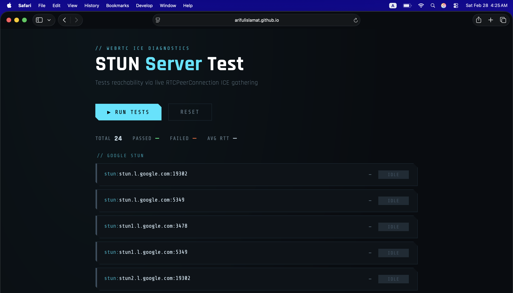

# 🔍 STUN Server Tester

A lightweight, browser-based diagnostic tool that tests the reachability and response time of public STUN servers using the **WebRTC ICE gathering** mechanism — no backend, no installs, just open and run.

🌐 **Live Demo:** [arifulislamat.github.io/stun-server-tester](https://arifulislamat.github.io/stun-server-tester/)

---

## ✨ Features

- ✅ Tests **24 public STUN servers** across two groups (Google + VoIP Community)
- ⚡ Measures real **response time (ms)** per server
- 🌍 Displays your **public IP address** as seen by each STUN server
- 📋 Live **event log** with timestamps
- 📊 Summary stats — total passed, failed, and average RTT
- 🎨 Clean, dark terminal-style UI
- 🚫 Zero dependencies, zero backend — pure HTML/CSS/JS

---

## 🚀 How It Works

Unlike simple ping tools, this tester creates a real `RTCPeerConnection` for each STUN server and listens for **ICE candidates**. When a `srflx` (server-reflexive) candidate is gathered, it confirms the STUN server:

1. Received the binding request
2. Replied with your public IP and port
3. Is fully functional for WebRTC use

This is the only truly accurate way to test STUN server reachability from a browser.

---

## 📡 Servers Tested

**Google STUN**
```
stun.l.google.com:19302      stun.l.google.com:5349
stun1.l.google.com:3478      stun1.l.google.com:5349
stun2.l.google.com:19302     stun2.l.google.com:5349
stun3.l.google.com:3478      stun3.l.google.com:5349
stun4.l.google.com:19302     stun4.l.google.com:5349
```

**VoIP Community STUN**
```
stun01.sipphone.com          stun.ekiga.net
stun.fwdnet.net              stun.ideasip.com
stun.iptel.org               stun.rixtelecom.se
stun.schlund.de              stunserver.org
stun.softjoys.com            stun.voiparound.com
stun.voipbuster.com          stun.voipstunt.com
stun.voxgratia.org           stun.xten.com
```

---

## 🖥️ Usage

### Option 1 — GitHub Pages (recommended)
Just visit the live demo link above. No setup needed.

### Option 2 — Run Locally
```bash
git clone https://github.com/arifulislamat/stun-server-tester.git
cd stun-server-tester
# Open index.html in any modern browser
open index.html
```

No build step, no dependencies.

---

## 📸 Screenshot

<div align="center">
  
</div>

---

## ⚠️ Notes

- Some older VoIP community servers (e.g. `sipphone.com`, `xten.com`) may time out — those companies changed hands years ago. A timeout is expected and not a safety concern.
- Results reflect **your network conditions**, not a remote server's connection.
- The tool requires a modern browser with WebRTC support (Chrome, Firefox, Edge, Safari).

---

## 📄 License

MIT License — feel free to use, fork, and modify.

---

## 👤 Author

**Ariful Islam** — [arifulislamat.com](https://arifulislamat.com)
